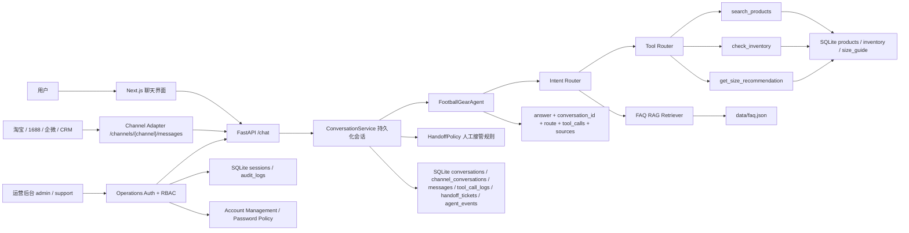
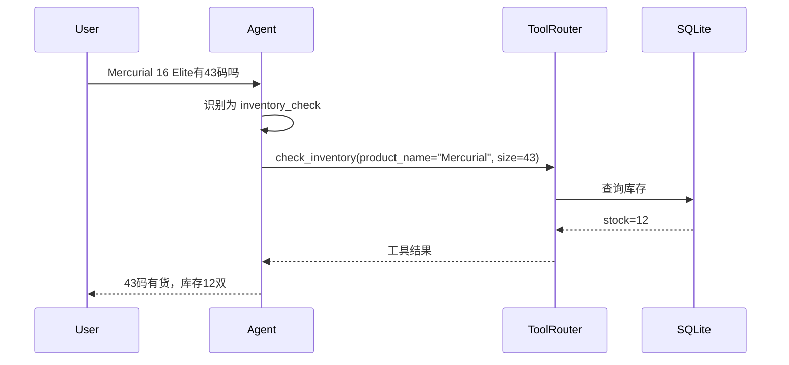
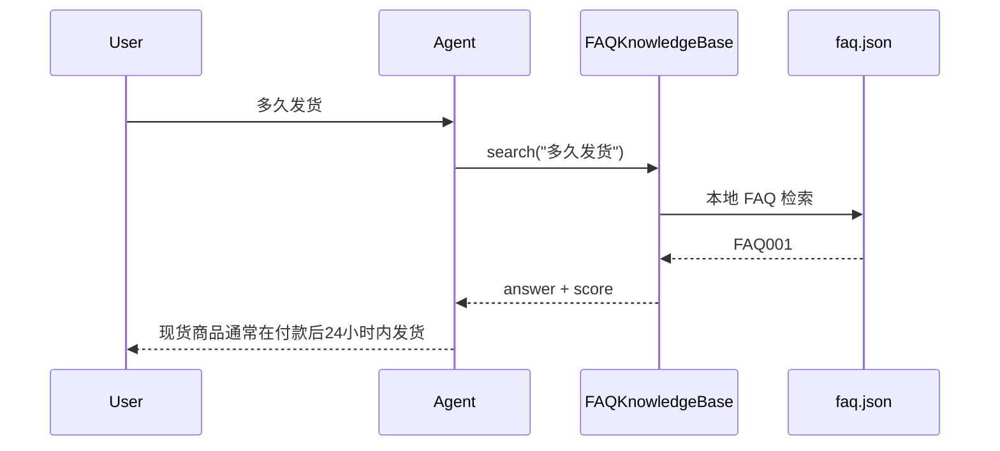
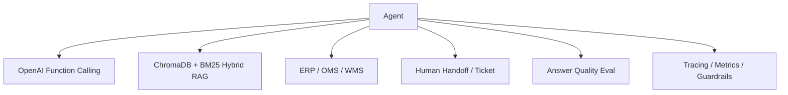

# 架构图

## MVP 架构

## Tool Calling 流程

## RAG 流程

## 设计取舍

- **OpenAI SDK 可选**：有 Key 时可启用 function calling；无 Key 时本地路由仍能展示 Agent 架构。
- **SQLite 优先**：比真实 ERP 简单，适合 MVP 和面试演示。
- **本地 FAQ 检索优先**：实现 RAG 闭环，后续可替换成 ChromaDB。
- **返回 tool_calls 和 sources**：便于解释 Agent 为什么这么回答。
- **ConversationService 独立**：Agent 保持无状态，真实渠道接入时由外层服务负责会话、消息和审计日志。
- **HandoffPolicy 独立**：投诉、退款、明确人工请求和订单异常会创建人工接管工单；普通 fallback 先澄清，不制造无效工单。
- **Handoff workflow 完整**：人工客服可以将工单更新为处理中或已解决，并记录处理人和备注。
- **Handoff guard**：会话转人工后暂停业务自动回复，避免 AI 和人工同时处理订单；身份和能力说明等安全元问题仍由 AI 自助回答。
- **Channel Adapter 独立**：淘宝/1688/企微只负责把外部用户和会话 ID 标准化，内部 Agent 不绑定任何渠道。
- **运营身份独立**：密码哈希、短期会话、角色校验和审计日志不进入 Agent 层，避免业务问答与后台权限耦合。
- **会话可撤销**：密码修改、管理员重置和账号停用都会主动撤销相关会话，降低凭据泄露后的风险。

## 可扩展方向

